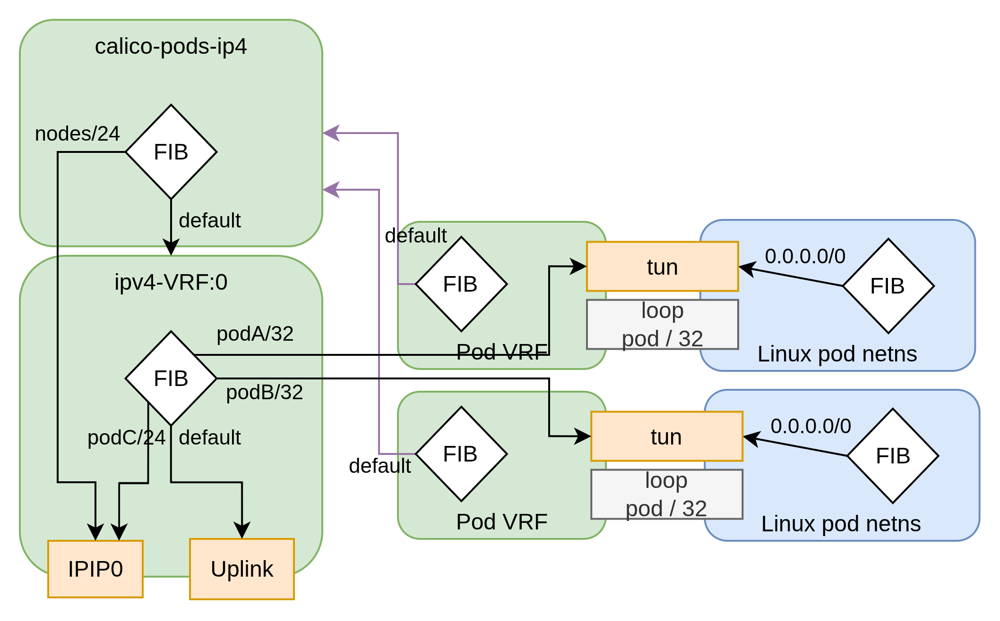
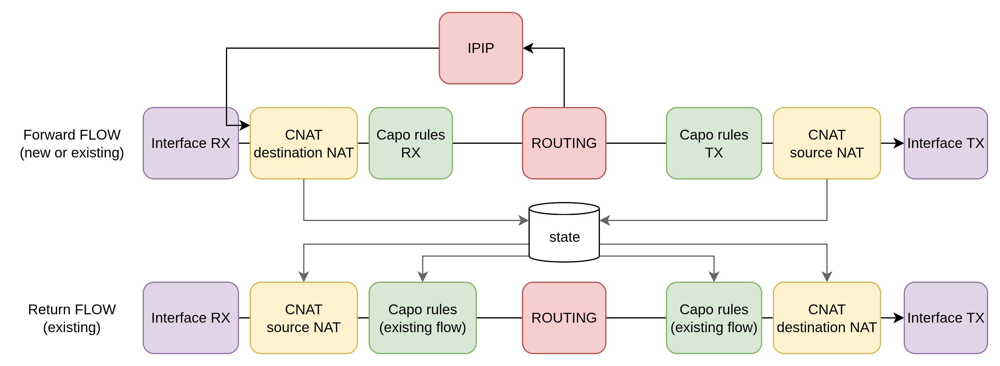
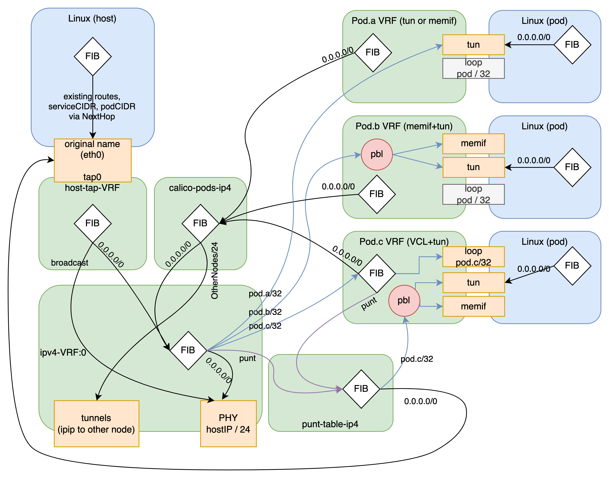

# Calico/VPP networking

- For troubleshooting, please consult [troubleshooting.md]
- For packet capture, please consult [pcap.md]

## Regular pod networking

The following diagram represents the case of regular tuntap pod
networking

## Packet path

Below is the typicall packet path. New packets go through

- destination NAT
- RX policies
- routing
- TX policies
- source NAT

Established forward flows, i.e. the same 5tuple as the first
packets will then go through

- destination NAT
- RX policies (cached verdict)
- routing
- TX policies (cached verdict)
- source NAT

Established return flows, i.e. the inverted 5tuple that was
transmitted for the first packet will then go through

- source NAT (undo dNAT)
- RX policies (cached verdict)
- routing
- TX policies (cached verdict)
- destination NAT (undo srcNAT)

## Full networking model

The following diagram represents the networking model Calico/VPP uses.
Pods a b & c are represented showcasing multiple consumption models :

- (a) uses a regular netdev (tun)
- (b) uses both memif & tuntap with the PBL (destination port
balancing, spliting packets between both interfaces)
- (c) uses the VCL (terminating L4+ in VPP, and punting packets
to a tun interface)

