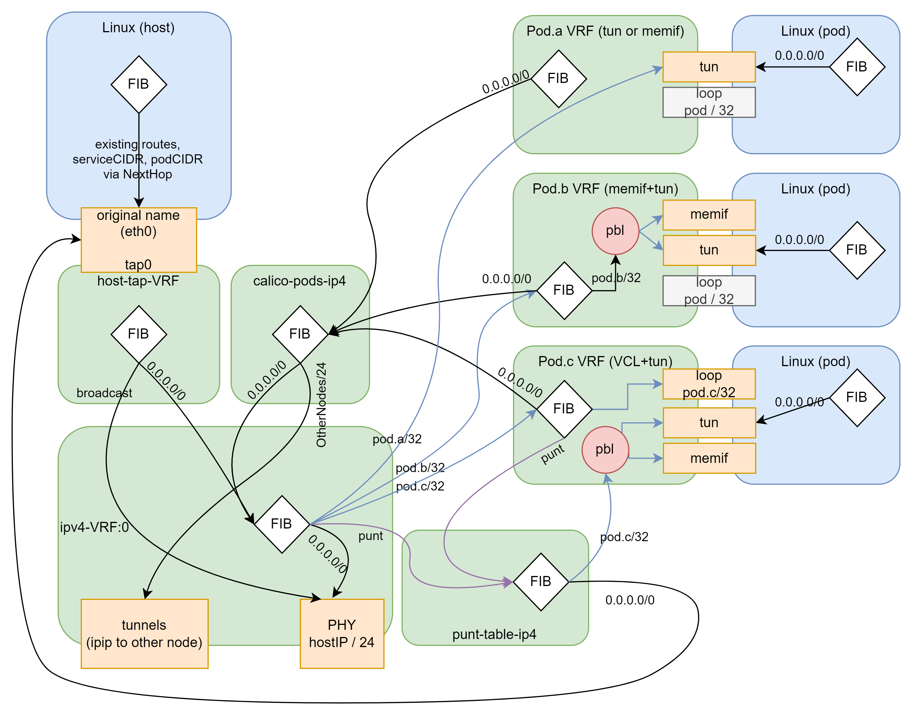

# Calico/VPP Pod networking & pod VRFs.

The following diagram represents the networking model Calico/VPP uses.
Pods a b & c are represented showcasing multiple consumption models :

- (a) uses a regular netdev (tun)
- (b) uses both memif & tuntap with the PBL (destination port balancing, spliting packets between both interfaces)
- (c) uses the VCL (terminating L4+ in VPP, and punting packets to a tun interface)

